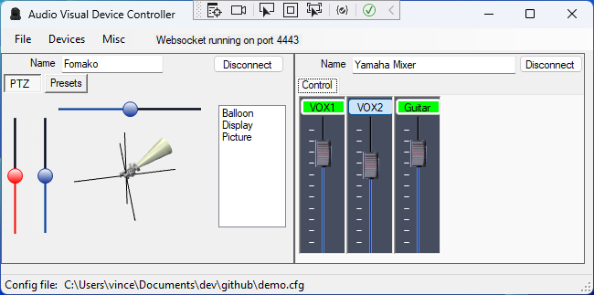

# AvDeviceControl
A/V - VISCA Camera and MIDI Audio Interface Application

This C# NET framework Windows form application implements a VISCA interface for PTZ video camera control,
and a MIDI interface for Audio mixer control. 

It serializes the configuration for multiple devices in an XML file that may be loaded and saved via
a file menu, and is loaded / saved at entry / exit. It presents user interfaces for each device in the configuration.

It implements a OBS Studio V5 compatible Websocket Server and is supported by the
[OBS Studio Remote](https://github.com/jacobvc/OBS-Studio-Remote) Web App

# Features

- Pan, Tilt, and Zoom support for VISCA cameras
- MIDI Audio Mixer Support
- Websocket Server, serving OBS Studio Websocket v5 compatible protocol

# Design
- MainForm Windows.Form
    - Loads / Saves DeviceConfigCollection
    - Maintains DeviceCollection
    - Hosts ucViscaCamera
    - Hosts ucMixer

- ucViscaCamera(CameraConfig) UserControl
  - Contains PtzController
    - Connects to PtzCamera using CameraConfig
  - Camera property is controller's camera
  - PtzMonitor polls camera for changes
  - Uses ViscaTransport

- ucMixer(Midi, MixerConfig) UserControl
    - Connects to Midi and establishes a MidiConnection
    - ucVolumeSlider UserControl for each channel
    - Uses Midi

- Transport
    - ViscaTransport VISCA (serial port) interface for camera
    - Midi - Midi interface for mixer
    - DeviceControlWebsocket - Protocol interface for websocket
        - uses Webserver - The websocket server
